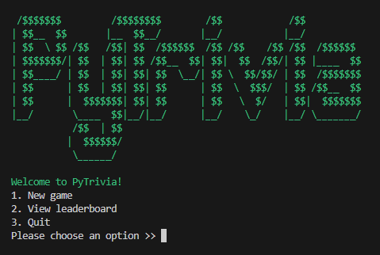
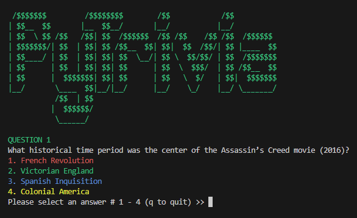
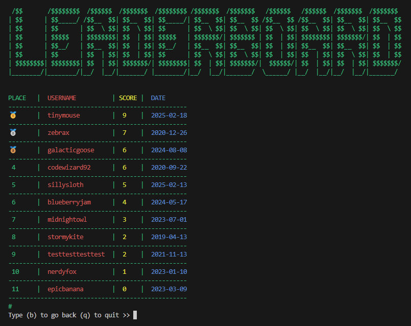

# PyTrivia

PyTrivia is a terminal-based trivia game written in Python. Players answer multiple-choice questions across various categories and difficulty levels, with sound effects, a persistent leaderboard, and a colorful interface.

## Features

- Sound effects for correct/incorrect answers, game over, and background music
- Five trivia categories (e.g., Video Games, Film, Music)
- Selectable difficulty levels: Easy, Medium, Hard, or All
- Persistent leaderboard stored in JSON
- Color-coded interface using colorama
- Questions pulled live from the Open Trivia DB API

## Getting Started

### 1. Clone the repo
```bash
git clone https://github.com/rastko-jovic/pytrivia.git
cd pytrivia
```

### 2. (Optional) Create a virtual environment
```bash
python -m venv venv
source venv/bin/activate  # On Windows: venv\Scripts\activate
```

### 3. Install dependencies
```bash
pip install -r requirements.txt
```

### 4. Run the game
```bash
python main.py
```

## Project Structure

```
pytrivia/
├── main.py
├── game_utils.py
├── sound_utils.py
├── ascii_art.py
├── resources/
│   ├── data/
│   │   └── leaderboard.json
│   └── sound/
├── requirements.txt
└── .gitignore
```

## Dependencies

- pygame
- requests
- colorama

## Contributing

Pull requests are welcome. If you have ideas for new features, feel free to fork and extend the game.

## License

MIT License

## Screenshots




# Credits
See  for attribution of sound effects used in this game.